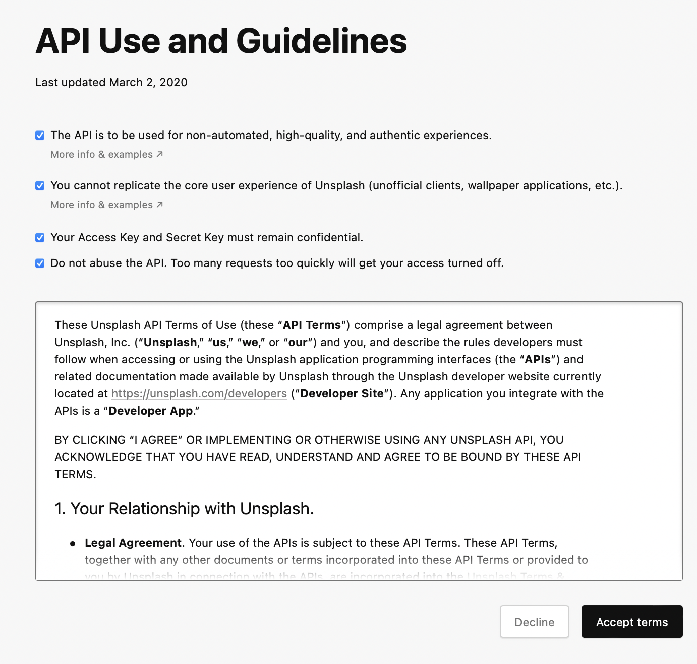
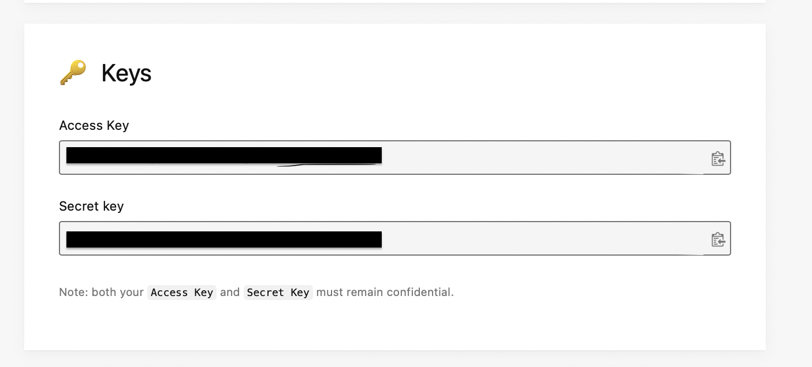
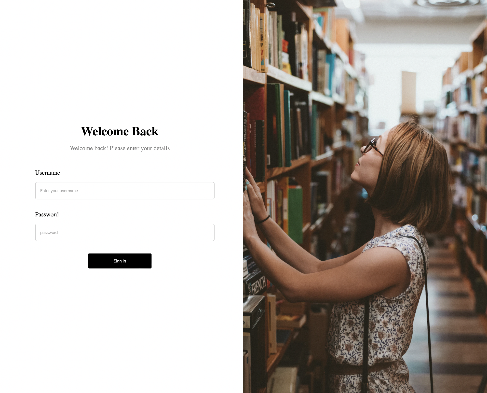

# Image_Gallery
<div align="center">

# Image Gallery
  <p align="center">
    
    
  </p>
</div>

## Getting Started

```
cp .env.sample .env   # cp .env.sample .env
cd api                # cd into server side
```
===> Change Unsplash public key with yours : 
[See how you can get unsplash key](#installation)

## Installation

```sh
cd image-gallery/  # cd into main directory
npm install -f                                  # install dependencies
==> in the main directory run :
npm run dev                                  

```

# How to get Unsplash Access Key

```
Go to https://unsplash.com/developers
Create new App
Follow steps below
```
<h3>Accept Terms</h3>
<p>  </p>
<h3>Copy Access Key</h3>
<p>  </p>

## Preview
<p>  </p>
<p>  </p>
<p>  </p>
